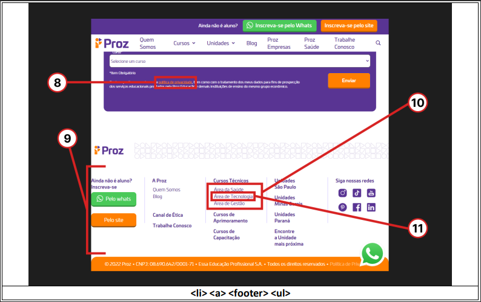
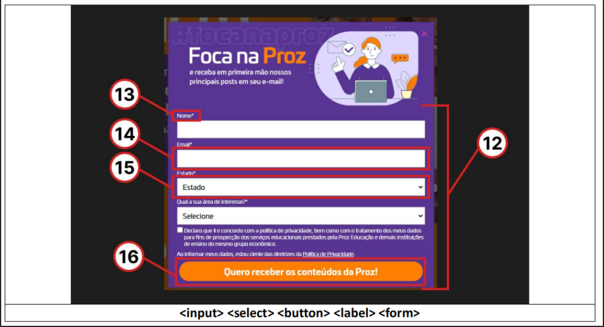

# Observe as três capturas de tela em anexo. Cada uma delas tem áreas sinalizadas e numeradas, além de um grupo específico de tags HTML logo embaixo.
### associe cada tag HTML com o respectivo número da área que o representa (Exemplo: 1. footer, 2. input, etc...) 

### A tag <strong>header</strong> está associada à área 1.

### A tag <strong>main</strong> está associada à área 2.
 
### A tag <strong>nav</strong> está associada à área 3.
 
### A tag <strong>img</strong> está associada à área 4.
 
### A tag <strong>h1</strong> está associada à área 5.

### A tag <strong>h2</strong> está associada à área 6.

### A tag <strong>p</strong> está associada à área 7.

### A tag <strong>a</strong> está associada à área 8.
 
### A tag <strong>footer</strong> está associada à área 9.
 
### A tag <strong>ul</strong> está associada à área 10.

### A tag <strong>li</strong> está associada à área 11.

### A tag <strong>form</strong> está associada à área 12.

### A tag <strong>input</strong> está associada à área 13.
 
### A tag <strong>label</strong> está associada à área 14.
 
### A tag <strong>select</strong> está associada à área 15.

### A tag <strong>button</strong> está associada à área 16.

# Curso em video HTML + CSS

## [<link>Curso Html + CSS Gustavo Guanabara</link>](https://youtu.be/Ejkb_YpuHWs?si=rApusPuLgyrlyKrk)
